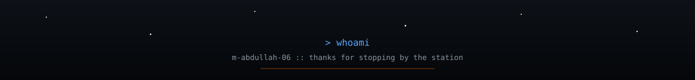

<div align="center">
  


<br/>


<br/>

[](https://github.com/m-abdullah-06)
[](https://github.com/m-abdullah-06/soc-analyst-portfolio)
[](https://shiplog.hashnode.dev)

</div>



## `$ ./boot_sequence.sh`

```bash
$ initializing NEXUS profile...
$ loading identity...      [OK]
$ mounting dev_stack...    [OK]
$ mounting sec_stack...    [OK]
$ establishing uplink...   [OK]
$ status: online. welcome to the station.
```


## `$ whoami` — Command Center

I'm **Muhammad Abdullah**, a final-semester DAE Software Engineering student at
Aligarh Institute of Technology, Karachi — currently piloting a transition from full-stack
development into cybersecurity.

- 🛠️ I build and ship real SaaS products solo — not tutorial projects
- 🛡️ Actively moving down the **SOC Analyst → Penetration Tester → Purple Team** path
- 📡 I document every SOC case I close on my [Ship Log](https://shiplog.hashnode.dev) blog
- 🔍 SOC portfolio live at [`m-abdullah-06/soc-analyst-portfolio`](https://github.com/m-abdullah-06/soc-analyst-portfolio)
- 🎸 Off-console: guitar, fitness, and getting lost in music


## `$ cat current_mission.log`

```
> SC-900     [██████████]  DONE ✅
> ISC2 CC    [██████████]  DONE ✅
> SC-200     [░░░░░░░░░░]  Next target
> DAE Finals [████████░░]  Closing out — graduating December 2026
```


## `$ ls -la featured_projects/`

<table>
<tr>
<td width="50%" valign="top">

### 🖥️ SoloDesk
**AI-powered Freelancer OS** — 🥈 Silver Tier, AI Seekho 2026 (10,000+ entries)

Client CRM, project pipeline, no-login client portal with two-way messaging,
AI email communicator, invoice & proposal builder.

`Next.js` `TypeScript` `Supabase` `Groq AI` `Vercel`

[`repo`](https://github.com/m-abdullah-06/SoloDesk) · [`live demo`](https://solo--desk.vercel.app)

</td>
<td width="50%" valign="top">

### 🪐 Stack Universe
**3D GitHub profile visualizer** — repos rendered as orbiting planets

AI narration, roast mode, analytics dashboard, multiplayer presence,
and an embeddable README widget. Shipped in 7 phases.

`React Three Fiber` `Three.js` `Next.js` `Supabase` `Groq`

[`repo`](https://github.com/m-abdullah-06/Stack-Universe) · [`launch post`](https://dev.to/mabdullah06)

</td>
</tr>
<tr>
<td width="50%" valign="top">

### 🔎 IOC Enrichment Tool
Pulls indicators of compromise and enriches them against threat intel
sources for faster SOC triage.

`Python` `VirusTotal API` `AbuseIPDB`

[`repo`](https://github.com/m-abdullah-06/IOC-Enricher) · [`live demo`](https://ioc-enricher-abd.vercel.app)

</td>
<td width="50%" valign="top">

### 🎣 Phishing Email Analyzer
Parses raw email headers and bodies to flag phishing indicators —
built from real LetsDefend case patterns.

`Python` `Header Parsing` `Threat Intel`

[`repo`](https://github.com/m-abdullah-06/Phishing-Analyzer) · [`live demo`](https://phishing-analyzer-abd.vercel.app/)

</td>
</tr>
</table>


## `$ cat tech_arsenal.json`

<table>
<tr><td valign="top" width="25%">

**Frontend**


</td><td valign="top" width="25%">

**Backend**


</td><td valign="top" width="25%">

**Security**


</td><td valign="top" width="25%">

**Cloud / DevOps**


</td></tr>
</table>


### `$ git log --graph --oneline`

<picture>
  <source media="(prefers-color-scheme: dark)" srcset="https://raw.githubusercontent.com/m-abdullah-06/m-abdullah-06/output/github-contribution-grid-snake-dark.svg"/>
  
</picture>


## `$ ls certifications/`

- ✅ **Microsoft SC-900** — Done
- ✅ **ISC2 Certified in Cybersecurity (CC)** — Done
- 🎯 **Microsoft SC-200** — Next target
- 🔓 **LetsDefend First Blood** — SOC335 (CVE-2024-49138) · Invited to write community walkthrough
- 🧭 **Free-tier roadmap:** Cisco NetAcad · Fortinet NSE 1/2/3 · Splunk Fundamentals · OPSWAT ICIP


## `$ cat side_quests.yml`

```yaml
guitar:      practicing daily, chasing better fingerstyle
space:       obsessed with the aesthetics of space stations and sci-fi UI
learning:    KQL, SC-200 prep, purple teaming concepts
```

<details>
<summary><b>$ sudo reveal-secret</b></summary>
<br>

```bash
$ sudo reveal-secret
[sudo] password for m-abdullah-06: ********
Access granted.

🏆 Achievement Unlocked: "First Blood" — SOC335 / CVE-2024-49138
🏆 Achievement Unlocked: "Silver Tier" — AI Seekho 2026, 10,000+ entries
🏆 Achievement Unlocked: "Community Contributor" — invited by LetsDefend CSM
   to write a public walkthrough

$ rm -rf attackers/
rm: cannot remove 'attackers/': Permission denied — nice try.
```

</details>


<div align="center">

</div>
